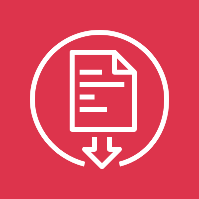

# AWS Artifact

<figure>
  
  <figcaption><center>AWS Artifact<br><i>Image source: AWS Documentation</i></center></figcaption>
</figure>

**Overview**: AWS Artifact is a self-service portal for on-demand access to AWS compliance reports and agreements. It provides the **audit artifacts** (SOC reports, PCI reports, ISO certifications, FedRAMP documentation) that customers need to demonstrate compliance to their own auditors. It also allows customers to accept agreements with AWS (e.g., Business Associate Addendum for HIPAA).

**Domain weight**: Appears in Management & Governance and Data Protection domains. AWS Artifact is a **supporting service** — typically 0–2 questions on the exam. Questions are straightforward: "Where do I find AWS compliance reports?" or "How do I accept a HIPAA BAA with AWS?"

## 1. AWS Artifact Reports

### 1.1. Available Reports

| Report Type            | Examples                                                          | Use Case                                                   |
| ---------------------- | ----------------------------------------------------------------- | ---------------------------------------------------------- |
| **SOC reports**        | SOC 1, SOC 2, SOC 3                                               | Demonstrate operational controls to auditors               |
| **PCI reports**        | PCI DSS level 1 (Attestation of Compliance, Report on Compliance) | Demonstrate PCI compliance for cardholder data             |
| **ISO certifications** | ISO 9001, ISO 27001, ISO 27017, ISO 27018, ISO 27701              | Show compliance with international security standards      |
| **FedRAMP**            | FedRAMP reports (various AWS regions)                             | Demonstrate compliance for US government workloads         |
| **HIPAA**              | HIPAA compliance documentation                                    | Demonstrate compliance for healthcare workloads            |
| **GDPR**               | GDPR documentation                                                | Demonstrate compliance for EU data protection              |
| **IRAP**               | IRAP reports (Australia)                                          | Demonstrate compliance for Australian government workloads |
| **C5**                 | C5 attestation (Germany)                                          | Demonstrate compliance for German cloud computing          |
| **K-ISMS**             | K-ISMS reports (Korea)                                            | Demonstrate compliance for Korean workloads                |
| **ENS**                | ENS reports (Spain)                                               | Demonstrate compliance for Spanish national security       |
| **MTCS**               | MTCS reports (Singapore)                                          | Demonstrate compliance for Singapore cloud security        |
| **OSPAR**              | OSPAR reports (Japan)                                             | Demonstrate compliance for Japanese cloud security         |
| **CS**                 | CS reports (India)                                                | Demonstrate compliance for Indian cloud security           |

### 1.2. Key Details

- Reports are **downloadable** in PDF format
- Reports are **periodically updated** by AWS (e.g., SOC reports are published semi-annually)
- Some reports require an **NDA** to be accepted before download
- Each report includes the **AWS customer** as the scope (not specific customer accounts)
- Reports can be **shared** with auditors, compliance teams, and stakeholders

**Exam scenario**: A customer's auditor needs to review AWS SOC 2 Type II report → download the report from **AWS Artifact** and share it with the auditor.

## 2. AWS Artifact Agreements

### 2.1. Purpose

- Accept **agreements** with AWS electronically (legally binding)
- Most common agreement: **Business Associate Addendum (BAA)** for HIPAA compliance
- Other agreements: NDA, GDPR Data Processing Addendum (DPA), etc.

### 2.2. Business Associate Addendum (BAA)

- Required for **HIPAA compliance** when running workloads that process protected health information (PHI)
- The BAA is an agreement between AWS and the customer
- When accepted, it applies to all accounts in the **AWS Organization** (or specific accounts)
- AWS offers BAA for specific services (not all services are HIPAA-eligible)
- The BAA must be accepted before deploying PHI workloads to AWS

### 2.3. How to Accept an Agreement

1. Go to AWS Artifact → Agreements → Create agreement
2. Select the agreement type (e.g., BAA for HIPAA)
3. Specify which accounts are covered (organization, specific accounts)
4. Accept the agreement (electronically signed)
5. The agreement is recorded and can be downloaded as PDF

**Exam scenario**: A healthcare organization needs to run a workload that processes protected health information (PHI) on AWS → accept the **Business Associate Addendum (BAA)** via AWS Artifact before deploying the workload.

## 3. AWS Artifact Organizations Integration

### 3.1. Centralized Management

- AWS Artifact integrates with **AWS Organizations** for centralized compliance management
- **Delegated administrator**: A member account can be designated to manage Artifact for the entire organization
- Agreements accepted at the organization level apply to all member accounts

### 3.2. Benefits

| Feature                 | Organization-Level                                | Account-Level                             |
| ----------------------- | ------------------------------------------------- | ----------------------------------------- |
| **Agreement scope**     | Applies to all accounts in the organization       | Applies only to that account              |
| **Report access**       | Centralized access for compliance teams           | Per-account access                        |
| **Management overhead** | Low (single point of management)                  | High (must manage per account)            |
| **Recommended?**        | ✅ Yes (for organizations with multiple accounts) | ❌ Not recommended for multi-account orgs |

**Exam scenario**: An organization with 50 AWS accounts needs to accept a BAA that covers all accounts → accept the BAA at the **organization level** through AWS Artifact (or designate the management account to manage it centrally).

## 4. Access Control

### 4.1. IAM Permissions

| Action                        | Description                     |
| ----------------------------- | ------------------------------- |
| `artifact:DownloadReport`     | Download a compliance report    |
| `artifact:AcceptAgreement`    | Accept an agreement with AWS    |
| `artifact:TerminateAgreement` | Terminate an accepted agreement |
| `artifact:GetReport`          | Get metadata about a report     |
| `artifact:GetAgreement`       | Get metadata about an agreement |
| `artifact:ListReports`        | List available reports          |

### 4.2. IAM Policy Example

```json
{
  "Version": "2012-10-17",
  "Statement": [
    {
      "Effect": "Allow",
      "Action": ["artifact:DownloadReport", "artifact:ListReports"],
      "Resource": "*"
    }
  ]
}
```

- There are no resource-level permissions (all Artifact resources are global)
- `Resource: "*"` is required for Artifact permissions

## 5. Common Exam Scenarios

1. **Compliance report access**: An auditor asks for AWS SOC 2 report → download from **AWS Artifact**.

2. **HIPAA BAA**: A customer needs to accept HIPAA Business Associate Addendum → use **AWS Artifact Agreements**.

3. **Multi-account BAA**: An organization has many accounts that need BAA coverage → accept at the **organization level** in AWS Artifact.

4. **NDA requirement**: Some reports require an NDA before download → accept the NDA in **AWS Artifact Agreements** first.

5. **FedRAMP documentation**: A government contractor needs FedRAMP compliance documentation → download from **AWS Artifact Reports**.

## 6. Exam Tips

1. **Artifact = compliance reports + agreements**: Use Artifact to download AWS compliance reports (SOC, PCI, ISO, FedRAMP) and accept agreements (BAA, NDA).

2. **BAA for HIPAA**: The most tested scenario — accept a BAA in Artifact before running HIPAA workloads.

3. **No technical controls**: Artifact provides documentation, not technical security controls. It does not encrypt data or monitor threats.

4. **Organization integration**: Accept agreements at the organization level to cover all accounts.

5. **Reports are free**: Downloading compliance reports from Artifact is free of charge.

6. **NDA required for some reports**: Some sensitive reports require an NDA to be accepted before download.

7. **Reports are regularly updated**: AWS updates reports periodically (e.g., SOC reports semi-annually).

8. **Not a security service**: Artifact is a compliance service — it does not protect your AWS environment.

9. **API access**: Artifact has an API (`artifact:GetReport`, `artifact:DownloadReport`) for programmatic access.

10. **No cross-region considerations**: Artifact is a global service — reports and agreements are not region-specific.
