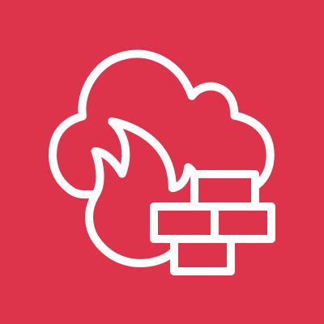

# AWS Network Firewall

<figure>
  
  <figcaption>
AWS Network Firewall <i>Image source: AWS Documentation</i>
</figcaption>
</figure>

**Overview**: AWS Network Firewall is a managed stateful firewall service for VPCs that provides traffic filtering and threat prevention at layers 3 through 7. It inspects traffic moving between VPCs, to the internet, and from on-premises networks. Network Firewall uses a Suricata-compatible rule engine for intrusion prevention (IPS), domain filtering, and stateful inspection.

**Domain weight**: Network Firewall appears in the Infrastructure Security domain (~20% of SCS-C03) alongside Security Groups, NACLs, and WAF. It is the answer for advanced VPC traffic inspection beyond what security groups and NACLs can provide.

## 1. What Network Firewall Does

| Capability                 | Description                                                  |
| -------------------------- | ------------------------------------------------------------ |
| **Stateful inspection**    | Tracks connection state and inspects traffic bidirectionally |
| **Intrusion prevention**   | Suricata-compatible IPS rules detect and block threats       |
| **Domain filtering**       | Allow or block traffic based on domain names (FQBN)          |
| **Traffic visibility**     | Logs matched and unmatched traffic to multiple destinations  |
| **Centralized management** | Policies can be centrally managed via Firewall Manager       |

## 2. Traffic Inspection Scope

| Traffic Path                   | Inspected?                                  |
| ------------------------------ | ------------------------------------------- |
| **VPC to internet**            | Yes (via IGW)                               |
| **VPC to VPC**                 | Yes (via Transit Gateway or VPC peering)    |
| **VPC to VPN/Direct Connect**  | Yes (hybrid traffic)                        |
| **Within the same VPC**        | No (traffic does not traverse the firewall) |
| **VPC to gateway endpoints**   | No (traffic stays within AWS network)       |
| **VPC to interface endpoints** | Can be configured                           |

## 3. Architecture and Deployment

### 3.1. How It Works

- Network Firewall is deployed in a **VPC** across **at least two Availability Zones** (for HA)
- It uses a **firewall endpoint** in each AZ (an elastic network interface)
- Route tables direct traffic **through** the firewall endpoint for inspection
- Traffic must be routed through the firewall to be inspected — it is not inline by default

### 3.2. Routing

- To inspect internet-bound traffic: Route table for private subnets points default route (0.0.0.0/0) to the **firewall endpoint** instead of the NAT Gateway
- The firewall inspects and then forwards traffic to the IGW (or NAT Gateway)
- For east-west inspection: Traffic between VPCs is routed through the firewall via Transit Gateway

**Exam scenario**: A company needs to inspect all outbound internet traffic from EC2 instances for malicious domains → deploy **Network Firewall** in the VPC and update the route tables to route traffic through the firewall endpoint.

## 4. Rule Groups

### 4.1. Stateless vs Stateful

| Feature                 | Stateless                                         | Stateful                                      |
| ----------------------- | ------------------------------------------------- | --------------------------------------------- |
| **Connection tracking** | No (each packet evaluated independently)          | Yes (tracks connection state)                 |
| **Rule capacity**       | 1,000 rules per group                             | Varies (based on Suricata rule complexity)    |
| **Default action**      | Forward or Drop for packets not matching any rule | Pass, Drop, or Alert for flows                |
| **Use case**            | First-pass filtering (protocol, port)             | Deep packet inspection, IPS, domain filtering |

### 4.2. Stateful Rule Options

| Rule Type | Description                  | Use Case                      |
| --------- | ---------------------------- | ----------------------------- |
| **Pass**  | Allow the traffic            | Whitelisting approved traffic |
| **Drop**  | Block the traffic silently   | Blocking malicious traffic    |
| **Alert** | Log the traffic but allow it | Monitoring suspicious traffic |

### 4.3. Suricata-Compatible Rules

- Network Firewall uses the **Suricata** open-source IPS engine
- Rules are written in Suricata format
- Capabilities:
  - Intrusion prevention (IPS)
  - Traffic inspection at multiple protocol layers
  - File inspection (detect malware in transferred files)
  - Decode and inspect TLS, HTTP, SMTP, DNS, etc.
- Suricata rules can be created manually or imported from threat intelligence feeds

**Exam scenario**: The security team wants to use custom intrusion prevention rules to detect specific attack patterns in VPC traffic → use **Suricata-compatible stateful rules** in AWS Network Firewall.

### 4.4. Domain Filtering

- Allow or block traffic based on **fully qualified domain names (FQDNs)**
- Two types of domain lists:
  - **Allow lists**: Only traffic to these domains is permitted
  - **Block lists**: Traffic to these domains is blocked
- Wildcards supported: `*.example.com`
- Useful for: Restricting outbound traffic to approved services only

**Exam scenario**: A company wants to restrict EC2 instances to only access approved AWS service endpoints (S3, SQS) and block all other internet destinations → use **Network Firewall domain filtering** with an allow list.

## 5. Logging

### 5.1. Log Destinations

| Destination               | Purpose                                           |
| ------------------------- | ------------------------------------------------- |
| **S3**                    | Long-term storage, compliance, Athena queries     |
| **CloudWatch Logs**       | Real-time monitoring, metric filters, alarms      |
| **Kinesis Data Firehose** | Streaming to analytics tools or third-party SIEMs |

### 5.2. Log Types

| Log Type       | Content                                            |
| -------------- | -------------------------------------------------- |
| **Alert logs** | Traffic that matched a rule with Alert action      |
| **Flow logs**  | Metadata about all traffic handled by the firewall |

- Alert logs are useful for security monitoring (what threats were detected)
- Flow logs are useful for traffic analysis (who is talking to whom)

## 6. Network Firewall vs Other Firewall Types

| Firewall             | Layer | State     | Scope    | Use Case                                              |
| -------------------- | ----- | --------- | -------- | ----------------------------------------------------- |
| **Security Group**   | L3/L4 | Stateful  | Instance | Simple allow rules for individual resources           |
| **NACL**             | L3/L4 | Stateless | Subnet   | Subnet-level allow/deny rules                         |
| **Network Firewall** | L3-L7 | Stateful  | VPC      | Advanced inspection, IPS, domain filtering            |
| **WAF**              | L7    | Stateful  | Web app  | Web application protection (SQLi, XSS, rate limiting) |
| **Shield**           | L3/L4 | N/A       | Global   | DDoS protection                                       |

**Exam tip**: If the scenario requires **domain filtering**, **intrusion prevention (IPS)**, or **deep packet inspection**, the answer is Network Firewall. If it requires web application protection (SQLi, XSS), the answer is WAF.

## 7. Integration with Other Services

| Service              | Integration                                                                              |
| -------------------- | ---------------------------------------------------------------------------------------- |
| **Firewall Manager** | Centrally manage Network Firewall policies across accounts                               |
| **CloudTrail**       | Logs all Network Firewall API calls                                                      |
| **CloudWatch**       | Metrics (packets, bytes, dropped traffic)                                                |
| **VPC Flow Logs**    | Complementary — Flow Logs capture metadata, Network Firewall captures inspection details |
| **Security Hub**     | Network Firewall findings can be forwarded to Security Hub                               |

## 8. Security Best Practices

- **Deploy across multiple AZs** for high availability
- **Use stateful rules** for most inspection needs — stateless rules for first-pass filtering
- **Enable alert logging** to CloudWatch Logs for real-time threat monitoring
- **Use Suricata-compatible rules** for IPS capabilities
- **Implement domain allow lists** for environments that only need access to specific services
- **Combine with WAF** for comprehensive application-layer and network-layer protection
- **Automate rule updates** using Firewall Manager for multi-account environments
- **Test rules in alert mode** before switching to drop mode

## 9. Limits and Quotas

| Resource                                 | Limit             |
| ---------------------------------------- | ----------------- |
| Firewalls per region per account         | 20                |
| Firewall policies per region per account | 100               |
| Stateful rule groups per firewall        | 20                |
| Stateless rule groups per firewall       | 20                |
| Stateful rules per group                 | 10,000 (suricata) |
| Stateless rules per group                | 1,000             |

## 10. Exam Tips

1. **Network Firewall is stateful and inspects at L3-L7** — it can inspect packet contents, not just headers.

2. **Suricata-compatible** — Network Firewall uses Suricata for IPS rules. Know that Suricata is the rule engine.

3. **Domain filtering** — allows or blocks traffic based on FQDNs. Use case: outbound allow lists for EC2 instances.

4. **Deployment architecture**: Firewall endpoint per AZ, route tables must direct traffic through the firewall.

5. **Stateful rules**: Pass (allow), Drop (block silently), Alert (log and allow). Know the difference.

6. **Stateless rules**: Evaluate each packet independently — use for first-pass filtering by protocol/port.

7. **Logging to three destinations**: S3 (archive), CloudWatch Logs (real-time), Kinesis Firehose (streaming).

8. **Alert logs** = threat detection. **Flow logs** = traffic metadata.

9. **Network Firewall vs WAF**: Network Firewall inspects all VPC traffic (any protocol). WAF inspects only HTTP/S traffic for web applications.

10. **Network Firewall vs Security Groups**: Security Groups are instance-level allow rules. Network Firewall provides VPC-wide inspection with IPS and domain filtering.

11. **Routing is critical** — traffic must be routed through the firewall endpoint. If traffic bypasses the firewall (e.g., direct route to IGW), it is not inspected.

12. **Multi-AZ deployment** is required for high availability — deploy firewall endpoints in at least two AZs.

13. **Firewall Manager** can centrally deploy Network Firewall policies across accounts.

14. **Test with Alert action** before switching to Drop to avoid blocking legitimate traffic.

15. **Network Firewall does not inspect traffic to gateway endpoints** (S3, DynamoDB) — that traffic stays within AWS's network and does not traverse the firewall.
