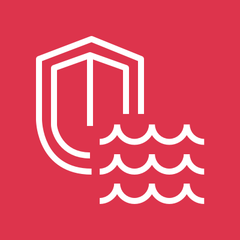

# Amazon Security Lake

<figure>
  
  <figcaption>
Amazon Security Lake <i>Image source: AWS Documentation</i>
</figcaption>
</figure>

**Overview**: Amazon Security Lake is a service that automatically centralizes security data from AWS environments, SaaS providers, on-premises sources, and third-party sources into a purpose-built data lake in Amazon S3. It normalizes all data to the **Open Cybersecurity Schema Framework (OCSF)** format, making it queryable across tools like Athena, OpenSearch, and QuickSight.

**Domain weight**: Security Lake appears in the Security Logging and Monitoring domain (~18% of SCS-C03) and Management and Security Governance domain (~14%). It is AWS's strategic service for centralizing security logs across accounts and regions.

## 1. What Security Lake Does

| Capability                    | Description                                                                                  |
| ----------------------------- | -------------------------------------------------------------------------------------------- |
| **Centralizes security data** | Aggregates logs from multiple AWS services, accounts, and regions into a single S3 data lake |
| **OCSF normalization**        | Automatically converts all data to the Open Cybersecurity Schema Framework standard          |
| **Automatic partitioning**    | Organizes data into S3 prefixes by source, region, account, and date                         |
| **Parquet format**            | Stores data in columnar Apache Parquet format for efficient querying                         |
| **Subscriber management**     | Controls which accounts/tools can access the data lake                                       |
| **Retention management**      | Configurable retention for each log source type                                              |

## 2. Supported Data Sources

### 2.1. AWS Sources

| Source                             | Logs Collected                                             |
| ---------------------------------- | ---------------------------------------------------------- |
| **CloudTrail management events**   | API activity across all AWS services                       |
| **CloudTrail data events**         | S3 object-level operations, Lambda invocations             |
| **VPC Flow Logs**                  | Network traffic metadata                                   |
| **Route 53 Resolver query logs**   | DNS query logs                                             |
| **AWS Security Hub findings**      | Aggregated findings from GuardDuty, Inspector, Macie, etc. |
| **AWS Lambda Execution Logs**      | Amazon CloudWatch Logs for AWS Lambda                      |
| **S3 access logs**                 | Server access logs for S3 buckets                          |
| **AWS Config configuration items** | Resource configuration snapshots and changes               |
| **Amazon EKS audit logs**          | Kubernetes API activity                                    |

### 2.2. Third-Party and Custom Sources

- Ingest security data from third-party sources (CrowdStrike, Palo Alto, etc.)
- Ingest custom application logs
- Data must be formatted in OCSF or transformed via a custom source integration
- Third-party sources can be sent directly to the Security Lake S3 bucket

## 3. OCSF (Open Cybersecurity Schema Framework)

### 3.1. Purpose

- An open standard for security event normalization
- Ensures that logs from different sources use the same schema
- Enables cross-source queries without data transformation
- Adopted by AWS and many security vendors

### 3.2. Benefits

- Query CloudTrail logs and VPC Flow Logs together using the same field names
- No need to write custom ETL pipelines for each data source
- Security Lake automatically converts AWS logs to OCSF format
- Enables consistent monitoring and alerting across all data sources

**Exam scenario**: A security team wants to correlate VPC Flow Logs with CloudTrail events but the schemas are different → use **Security Lake** which normalizes all data to OCSF format automatically.

## 4. How Security Lake Works

### 4.1. Architecture

1. Security Lake creates an S3 bucket in your account (or you specify one)
2. You select which log sources to collect
3. Security Lake continuously collects data from those sources
4. Data is converted to OCSF format and stored as Apache Parquet in the S3 bucket
5. Data is partitioned by: `source/region/account_id/year/month/day/`
6. You configure subscribers (accounts or services) that can access the data

### 4.2. Data Collection

- **Continuous**: Security Lake continuously collects data as it is generated
- **Automatic**: No manual data pipeline needed for AWS sources
- **Regional**: Security Lake operates per region (use a single region for centralization)
- **Cross-account**: Supports collection from multiple accounts via AWS Organizations

### 4.3. Storage Format

| Feature          | Details                                    |
| ---------------- | ------------------------------------------ |
| **Format**       | Apache Parquet (columnar)                  |
| **Compression**  | Snappy compression                         |
| **Partitioning** | `source/region/account_id/year/month/day/` |
| **Encryption**   | SSE-S3 or SSE-KMS                          |

## 5. Subscribers

### 5.1. Purpose

- Subscribers are accounts or services that can access the Security Lake data
- Two types of subscribers:
  - **AWS account**: Another AWS account that can query the data via Athena
  - **Service** (e.g., OpenSearch, QuickSight, third-party SIEM): A service that ingests data from the lake

### 5.2. Access Control

- Each subscriber gets access to specific data sources
- Access is granted via resource policies on the S3 bucket
- Subscribers do not need direct access to the source accounts — they query the centralized data lake

**Exam scenario**: A SIEM vendor needs access to CloudTrail logs from all 100 accounts → create a **subscriber** in Security Lake for the SIEM with access to the CloudTrail source.

## 6. Multi-Account Management

- Designate a **delegated administrator** from the management account of AWS Organizations
- The delegated admin configures Security Lake for the entire organization
- Logs from all member accounts are automatically collected into the central data lake
- Member accounts do not need individual Security Lake configuration

**Exam scenario**: A security team wants a central data lake with normalized security logs from all accounts and regions → designate a **Security Lake delegated administrator** to configure organization-wide collection.

## 7. Integration with Analytics Services

| Service         | Use Case                                                                   |
| --------------- | -------------------------------------------------------------------------- |
| **Athena**      | Run standard SQL queries on security data in the lake                      |
| **OpenSearch**  | Real-time visualizations and dashboards on security data                   |
| **QuickSight**  | Business intelligence and reporting on security posture                    |
| **AWS Glue**    | The Glue Data Catalog is automatically populated with Security Lake tables |
| **EMR / Spark** | Custom big data analytics on security data                                 |

### 7.1. Security Lake + Athena

- Athena can query Security Lake data using standard SQL
- Glue Data Catalog tables are created automatically
- Example: `SELECT * FROM cloud_trail_logs WHERE eventName = 'ConsoleLogin' AND region = 'us-east-1'`
- No ETL or schema management needed — Security Lake handles it all

### 7.2. Security Lake + OpenSearch

- Security Lake can stream data to Amazon OpenSearch Service
- Enables real-time dashboards and alerting on normalized security data
- Use case: Visualize failed login attempts across all accounts in one dashboard

## 8. Cost

| Cost Driver             | Details                                               |
| ----------------------- | ----------------------------------------------------- |
| **Data ingestion**      | Per GB of data collected from source services         |
| **S3 storage**          | Standard S3 pricing for the data lake bucket          |
| **Data transformation** | Cost for converting data to OCSF/Parquet format       |
| **Data consumption**    | Cost for subscribers querying the data (Athena, etc.) |

- Costs are incurred in the account where Security Lake is configured
- Can be reduced by selecting only relevant log sources
- Data lifecycle policies can transition older data to lower-cost storage tiers

## 9. Security Best Practices

- **Use SSE-KMS** for encryption of Security Lake data — separate access control from the S3 bucket
- **Restrict subscriber access** to only the log sources they need
- **Enable CloudTrail** on the Security Lake S3 bucket to monitor data access
- **Use lifecycle policies** to transition older data to Glacier for cost-effective long-term retention
- **Monitor Security Lake** with CloudTrail (CreateDataLake, UpdateDataLake, DeleteDataLake)
- **Integrate with Security Hub** for centralized security monitoring

## 10. Security Lake vs Other Log Storage Options

| Feature                      | S3 + Athena        | CloudWatch Logs          | Security Lake                  |
| ---------------------------- | ------------------ | ------------------------ | ------------------------------ |
| **Normalization**            | None (raw logs)    | None (raw logs)          | OCSF (automatic)               |
| **Format**                   | JSON / text (raw)  | JSON / text (raw)        | Parquet (columnar)             |
| **Multi-source correlation** | Manual (joins)     | Manual                   | Automatic (common schema)      |
| **Setup effort**             | Manual (pipelines) | Minimal                  | Minimal (for AWS sources)      |
| **Third-party ingestion**    | Manual             | Manual                   | Supported                      |
| **AWS service integration**  | Athena, QuickSight | CloudWatch Logs Insights | Athena, OpenSearch, QuickSight |

**Exam tip**: Security Lake is the **best choice for centralized, normalized, multi-account security data** that needs to be queried across sources. S3 + Athena is a simpler solution if you only need raw logs. CloudWatch Logs is best for real-time monitoring and alerting.

## 11. Exam Tips

1. **Security Lake centralizes and normalizes** security logs from multiple AWS accounts, regions, and sources into a single S3 data lake.

2. **OCSF** (Open Cybersecurity Schema Framework) is the key differentiator — Security Lake automatically converts all data to OCSF format, enabling cross-source queries without manual ETL.

3. **Parquet format** with Snappy compression optimizes storage and query performance.

4. **Subscribers** control which accounts or services can access specific data sources — not everyone has access to everything.

5. **Multi-account**: Use a delegated administrator for organization-wide Security Lake configuration.

6. **Security Lake does not replace CloudTrail or VPC Flow Logs** — it ingests their data and stores it normalized. The original services still need to be enabled.

7. **Athena + Security Lake**: Standard SQL queries on normalized security data. Glue Data Catalog is populated automatically.

8. **OpenSearch + Security Lake**: Real-time dashboards and visualizations.

9. **Third-party sources**: Security Lake can ingest data from non-AWS sources formatted in OCSF.

10. **Partitioning**: Data is organized by source, region, account, and date — making queries efficient by filtering on these partitions.

11. **Security Lake is not a SIEM** — it is a data lake for security data. It provides the foundational storage and normalization layer, but you still need analytics tools (Athena, OpenSearch) or a SIEM to consume the data.

12. **KMS encryption**: Use SSE-KMS for defense-in-depth — control who can decrypt the security data separately from who can access the S3 bucket.

13. **Lifecycle policies**: Transition older data to Glacier for cost-effective long-term retention to meet compliance requirements.

14. **CloudTrail monitoring**: Monitor Security Lake configuration changes via CloudTrail (CreateDataLake, UpdateDataLake, DeleteDataLake).

15. **Security Lake + Security Hub**: Security Hub aggregates findings, Security Lake stores normalized logs for deeper analysis. They complement each other.
