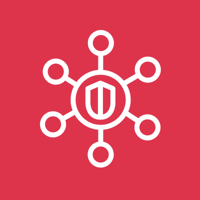

# AWS Security Hub

<figure>
  
  <figcaption>
AWS Security Hub <i>Image source: AWS Documentation</i>
</figcaption>
</figure>

**Overview**: AWS Security Hub is a cloud security posture management (CSPM) service that aggregates findings from multiple AWS security services and evaluates your environment against industry compliance standards. It provides a single pane of glass for security alerts, compliance status, and resource health across accounts and regions. On the exam, Security Hub is the central aggregation and compliance hub — GuardDuty detects threats, Inspector finds vulnerabilities, Config checks compliance, and Security Hub pulls it all together.

**Domain weight**: Security Hub appears in the Security Logging and Monitoring domain (~18% of SCS-C03) and Management and Security Governance domain (~14%). It is referenced in nearly every multi-service security scenario.

## 1. What Security Hub Does

| Capability                                   | Description                                                                                                                |
| -------------------------------------------- | -------------------------------------------------------------------------------------------------------------------------- |
| **Finding aggregation**                      | Collects and normalizes findings from GuardDuty, Inspector, Macie, Config, Firewall Manager, Health, and third-party tools |
| **Compliance standards**                     | Continuously checks accounts against CIS, PCI DSS, NIST, SOC 2, and AWS Foundational Security Best Practices               |
| **CSPM (Cloud Security Posture Management)** | Evaluates resource configurations against security best practices                                                          |
| **Insights**                                 | Groups related findings into actionable buckets                                                                            |
| **Automation rules**                         | Automatically suppresses, updates, or forwards findings based on criteria                                                  |
| **Cross-account / cross-region aggregation** | Centralizes findings from multiple accounts and regions                                                                    |

## 2. Security Standards and Controls

### 2.1. Standards

Security Hub evaluates accounts against built-in compliance standards. Each standard contains a set of **controls** (individual checks).

| Standard                                            | Description                                                                         | Controls                   |
| --------------------------------------------------- | ----------------------------------------------------------------------------------- | -------------------------- |
| **AWS Foundational Security Best Practices (FSBP)** | AWS-recommended security checks covering core services (IAM, S3, EC2, Lambda, etc.) | 100+                       |
| **CIS AWS Foundations Benchmark v1.4 / v3.0**       | Center for Internet Security benchmark for AWS                                      | ~50-60                     |
| **PCI DSS**                                         | Payment Card Industry Data Security Standard                                        | ~40                        |
| **NIST SP 800-53**                                  | US government security and privacy controls                                         | ~200+                      |
| **SOC 2**                                           | Service Organization Control 2 trust principles                                     | Varies by enabled services |

**Exam scenario**: A security team needs to continuously monitor compliance against the CIS AWS Foundations Benchmark → enable **Security Hub** and enable the **CIS AWS Foundations** standard.

### 2.2. Controls

- Each control maps to a specific security check (e.g., `S3.1` = S3 bucket public read prohibited, `IAM.7` = IAM root user MFA enabled)
- Controls can be **enabled** or **disabled** individually
- Control statuses:
  - **PASSED**: The resource meets the control requirement
  - **FAILED**: The resource does not meet the control requirement
  - **WARNING**: The control could not be evaluated (e.g., missing permissions)
  - **NOT_AVAILABLE**: The control is not applicable
- Each failing control links to the specific resource and the remediation steps

### 2.3. Control Finding Format

Security Hub finding format: `<Standard>/<ControlId>` (e.g., `CIS 1.4` / `S3.1`, `FSBP` / `IAM.7`)

## 3. Finding Aggregation

### 3.1. Integrated Services

Security Hub automatically receives findings from:

| Service              | What Findings Are Aggregated                                                            |
| -------------------- | --------------------------------------------------------------------------------------- |
| **GuardDuty**        | Threat detection findings (malicious activity, compromise indicators)                   |
| **Inspector**        | Vulnerability scan findings (CVEs, network reachability, CIS deviations)                |
| **Macie**            | Sensitive data discovery findings (PII, credentials in S3)                              |
| **AWS Config**       | Resource compliance findings (via Config rules)                                         |
| **Firewall Manager** | WAF, Shield, Network Firewall compliance findings                                       |
| **Health**           | AWS service health events affecting security                                            |
| **Third-party**      | Findings from integrated partner tools (CrowdStrike, Qualys, etc.) via Security Hub API |

**Exam tip**: Security Hub does NOT ingest CloudTrail, VPC Flow Logs, or Route 53 logs directly. It only ingests **findings** from security services. For raw log analysis, use Security Lake, CloudWatch Logs, or Athena.

### 3.2. Finding Format

All findings received by Security Hub are normalized to the **AWS Security Finding Format (ASFF)** — a JSON schema that includes:

| Field           | Description                                                                            |
| --------------- | -------------------------------------------------------------------------------------- |
| `SchemaVersion` | ASFF version                                                                           |
| `Id`            | Unique finding identifier                                                              |
| `ProductArn`    | The service that generated the finding                                                 |
| `GeneratorId`   | The rule/control that generated the finding                                            |
| `AwsAccountId`  | The account where the finding was generated                                            |
| `Types`         | Finding classification (e.g., `Software and Configuration Checks/Vulnerabilities/CVE`) |
| `Severity`      | Normalized severity (0.1-100)                                                          |
| `Region`        | The region where the finding originated                                                |
| `Resources`     | Affected AWS resources                                                                 |
| `Compliance`    | For Config/standard findings: PASSED/FAILED/WARNING                                    |
| `Workflow`      | Current status: NEW, NOTIFIED, SUPPRESSED, RESOLVED                                    |
| `RecordState`   | ACTIVE or ARCHIVED                                                                     |

### 3.3. Finding Workflow Status

| Status         | Description                                                                     |
| -------------- | ------------------------------------------------------------------------------- |
| **NEW**        | Default state — finding has not been reviewed                                   |
| **NOTIFIED**   | Someone has been notified about the finding                                     |
| **SUPPRESSED** | Finding is hidden from the default view (known false positive or accepted risk) |
| **RESOLVED**   | The issue has been fixed                                                        |

## 4. Insights

### 4.1. What Insights Are

- Groups of related findings created by Security Hub's analysis
- Pre-built insights are provided (cannot be modified)
- Custom insights can be created
- Insights answer questions like:
  - Which accounts have the most critical findings?
  - Which resources are generating the most findings?
  - Which finding types are most common?
  - Which regions have unresolved findings?

### 4.2. Pre-Built Insights

| Insight                             | Purpose                                      |
| ----------------------------------- | -------------------------------------------- |
| **Top security findings**           | Most common finding types                    |
| **Accounts with most findings**     | Which accounts need attention                |
| **Resources with most findings**    | Which resources are problematic              |
| **Critical findings by region**     | Geographic distribution of critical findings |
| **Findings by compliance standard** | Which standards have the most failures       |

### 4.3. Custom Insights

- Define your own grouping criteria (e.g., group all findings affecting a specific VPC)
- Useful for organization-specific investigation workflows

**Exam scenario**: A security team wants to group all findings related to a specific application by tagging → create a **custom insight** that groups findings by resource tags.

## 5. Automation Rules

### 5.1. Purpose

- Automatically update the **workflow status** or **severity** of findings based on matching criteria
- Applied when findings are **ingested** (not retroactive)
- Can suppress known false positives, auto-notify specific teams, or auto-resolve expected findings

### 5.2. Rule Criteria

Rules match on finding attributes:

- `AwsAccountId`, `Region`, `Types`, `Severity`, `Compliance.Status`, `ResourceType`, `ResourceTags`, `Workflow.Status`, `ProductArn`

### 5.3. Rule Actions

| Action              | Description                                                                   |
| ------------------- | ----------------------------------------------------------------------------- |
| **SUPPRESSED**      | Hide the finding — useful for known false positives                           |
| **NOTIFIED**        | Mark as notified — triggers configured notification workflows                 |
| **RESOLVED**        | Auto-resolve — useful when the issue is already remediated by another process |
| **Update severity** | Override the severity (raise or lower)                                        |

**Exam scenario**: A security scanning tool generates low-severity findings that are known false positives → create an **automation rule** to automatically suppress findings matching the tool's `ProductArn` with severity `LOW`.

## 6. Custom Actions

- Define custom actions that send findings to **EventBridge** for external processing
- When a user selects a finding and invokes the custom action, Security Hub sends the finding to EventBridge
- Common use: Send critical findings to a ticketing system (Jira, ServiceNow) or a SIEM

**Exam scenario**: When a critical finding is identified, the security team wants to automatically create a ticket in ServiceNow → set up a **custom action** in Security Hub that sends the finding to EventBridge → Lambda → ServiceNow API.

## 7. Multi-Account and Multi-Region

### 7.1. Delegated Administrator

- Designate a **Security Hub delegated administrator** from the management account of AWS Organizations
- The delegated admin can:
  - Enable Security Hub for all member accounts automatically
  - View findings from all accounts in a single console
  - Manage standards, insights, and automation rules centrally
  - Link member accounts automatically as they join the organization

**Exam scenario**: A security team needs to monitor compliance across 100 accounts from a single console → designate a **Security Hub delegated administrator**.

### 7.2. Cross-Region Aggregation

- By default, Security Hub operates per region — you see findings only from that region
- **Cross-Region aggregation** lets you designate a **linking region** that receives findings from all other regions
- All findings from linked regions appear in the linking region's console
- Reduces the need to switch between regions during investigation
- Cannot be undone once configured (without contacting AWS support)

**Exam scenario**: A security team manages accounts in 15 regions and wants to see all findings in one region → enable **cross-Region aggregation** in Security Hub to link all regions to `us-east-1`.

### 7.3. Administrator vs Member Accounts

| Account Type                | Capabilities                                                                       |
| --------------------------- | ---------------------------------------------------------------------------------- |
| **Delegated administrator** | Enables Security Hub org-wide, manages standards/insights/rules, sees all findings |
| **Member account**          | Sees own findings, can manage local settings if not restricted                     |

## 8. Integration with Other Services

| Service              | Integration                                                                  |
| -------------------- | ---------------------------------------------------------------------------- |
| **GuardDuty**        | Findings automatically forwarded to Security Hub                             |
| **Inspector**        | Findings automatically forwarded to Security Hub                             |
| **Macie**            | Findings automatically forwarded to Security Hub                             |
| **AWS Config**       | Config rule compliance results forwarded to Security Hub                     |
| **Firewall Manager** | Policy compliance results forwarded to Security Hub                          |
| **Detective**        | Pivot from Security Hub findings into Detective for investigation            |
| **EventBridge**      | Security Hub findings sent to EventBridge for automated response             |
| **Lambda**           | Custom remediation triggered by Security Hub findings via EventBridge        |
| **Audit Manager**    | Security Hub findings used as audit evidence                                 |
| **Security Lake**    | Security Hub findings can be stored in Security Lake for long-term retention |
| **AWS Health**       | Service health events affecting security appear as findings                  |

## 9. Security Hub vs Other Services

| Service           | Role                                                                             |
| ----------------- | -------------------------------------------------------------------------------- |
| **Security Hub**  | Aggregates findings, checks compliance, provides central dashboard               |
| **GuardDuty**     | Detects active threats (malicious activity) — Security Hub consumes its findings |
| **Inspector**     | Finds vulnerabilities — Security Hub consumes its findings                       |
| **Macie**         | Discovers sensitive data — Security Hub consumes its findings                    |
| **Config**        | Tracks resource compliance — Security Hub consumes its findings                  |
| **Detective**     | Investigates findings — you pivot FROM Security Hub TO Detective                 |
| **Audit Manager** | Prepares audit evidence — Security Hub findings are a data source for it         |

**Exam tip**: Security Hub is the **aggregator**. It does not detect threats (GuardDuty), find vulnerabilities (Inspector), discover data (Macie), or track resources (Config). It **collects their findings** into one place.

## 10. Cost

| Cost Driver                  | Details                                            |
| ---------------------------- | -------------------------------------------------- |
| **Finding ingestion**        | Per finding ingested (first 10,000 per month free) |
| **Compliance checks**        | Per control check per account per region           |
| **Cross-Region aggregation** | Additional cost for data transfer between regions  |
| **Third-party integration**  | Varies by partner — depends on finding volume      |

- Cost scales with number of accounts, regions, and enabled standards
- Can be reduced by disabling unnecessary standards or controls
- The free tier includes 30-day trial of Security Hub with all features

## 11. Security Best Practices

- **Enable Security Hub in all accounts and regions** — use delegated administrator for organization-wide enablement
- **Enable cross-Region aggregation** in a central region (e.g., `us-east-1` or `eu-west-1`)
- **Enable relevant standards** — FSBP and CIS are the most commonly enabled
- **Disable unnecessary controls** to reduce noise and cost
- **Create automation rules** to suppress known false positives and auto-resolve expected findings
- **Integrate with EventBridge** for automated response to critical findings
- **Set up custom insights** for your specific monitoring needs
- **Review findings daily** — unresolved findings accumulate and indicate security gaps
- **Export findings to Security Lake** or S3 for long-term retention and compliance
- **Monitor Security Hub itself** with CloudTrail (`BatchEnableStandards`, `UpdateFindingAggregator`, `CreateActionTarget`, etc.)

## 12. Limits and Quotas

| Resource                             | Limit                                                         |
| ------------------------------------ | ------------------------------------------------------------- |
| Accounts per delegated administrator | 5,000                                                         |
| Regions (linked regions)             | All commercial regions                                        |
| Standards per account                | 5 (default), can be increased                                 |
| Controls per standard                | Varies (50-200+)                                              |
| Insights (custom) per account        | 100                                                           |
| Automation rules per account         | 100                                                           |
| Custom actions per account           | 50                                                            |
| Finding retention                    | 90 days for standard retention; can be extended via S3 export |
| Maximum finding update batch         | 100 findings per API call                                     |

## 13. Troubleshooting

### 13.1. No Findings Appearing

- Verify Security Hub is **enabled** in the correct region
- Verify integrated services (GuardDuty, Inspector, etc.) are **enabled and generating findings**
- Check that the delegated administrator configuration includes the member accounts
- For Config findings: verify Config rules are enabled and evaluating

### 13.2. Compliance Standards Show No Data

- The standard must be **enabled** — enabled by default when you enable Security Hub
- Controls take time to evaluate (up to 2 hours for initial evaluation)
- Verify the required service for the control is enabled (e.g., `cloud-trail-enabled` requires CloudTrail)

### 13.3. Cross-Region Aggregation Not Working

- Verify that **linking region** is correctly configured
- Check that both source and linking regions have Security Hub enabled
- Can take up to 15 minutes for findings to appear in the linking region

## 14. Exam Tips

1. **Security Hub is the central aggregator** — it does NOT detect, scan, or investigate. It collects findings from GuardDuty, Inspector, Macie, Config, and Firewall Manager into a single dashboard.

2. **Compliance standards**: Security Hub checks accounts against FSBP, CIS, PCI DSS, NIST, and SOC 2. Enable the ones relevant to your compliance needs.

3. **Cross-Region aggregation** links findings from multiple regions into one region — essential for multi-region environments.

4. **Automation rules** auto-update findings on ingestion — suppress false positives, notify teams, or resolve expected findings automatically.

5. **Custom actions** send findings to EventBridge for integration with ticketing systems, SIEMs, or custom workflows.

6. **Insights group findings** — pre-built and custom insights help prioritize what to investigate.

7. **Finding format**: All findings normalized to ASFF (AWS Security Finding Format). Key fields: `ProductArn`, `Types`, `Severity`, `Compliance.Status`, `Workflow.Status`, `Resources`.

8. **Workflow status**: NEW → NOTIFIED → RESOLVED (or SUPPRESSED). Track findings through investigation.

9. **90-day finding retention** in Security Hub. Export to S3 or Security Lake for longer retention.

10. **Detective integration**: Pivot from Security Hub to Detective for root cause analysis — Security Hub provides the overview, Detective provides the deep dive.

11. **Security Hub does not replace GuardDuty/Inspector/Macie** — it complements them. You need the source services enabled and generating findings.

12. **Free 30-day trial** — after that, pay per finding ingestion and control check.

13. **Delegated administrator** is the standard pattern for multi-account Security Hub management.

14. **Control IDs** follow the pattern `<Standard>/<ControlId>` — e.g., `FSBP/S3.1`, `CIS 1.4/1.4` — know this format for exam questions.

15. **Third-party findings** can be ingested via the Security Hub API — Security Hub is not limited to AWS services.
