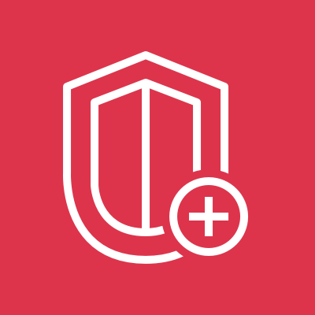

# AWS Shield & Shield Advanced

<figure>
  
  <figcaption>
AWS Shield <i>Image source: AWS Documentation</i>
</figcaption>
</figure>

**Overview**: AWS Shield is a managed DDoS protection service that safeguards web applications running on AWS. It provides always-on detection and automatic inline mitigations to minimize application downtime and latency. Shield comes in two tiers — Standard (free) and Advanced (paid).

**Domain weight**: Shield appears in the Infrastructure Security domain (~20% of SCS-C03) alongside WAF, CloudFront, and Network Firewall. It is the go-to service for DDoS protection scenarios.

## 1. Shield Standard

| Feature        | Details                                                            |
| -------------- | ------------------------------------------------------------------ |
| **Cost**       | Free — included with all AWS accounts                              |
| **Protection** | Network (L3) and transport (L4) layer DDoS attacks                 |
| **Automatic**  | Always-on detection and mitigation — no configuration needed       |
| **Coverage**   | All AWS resources (Route 53, CloudFront, ALB, ELB, etc.)           |
| **Mitigation** | SYN floods, UDP floods, reflection attacks, and other L3/4 attacks |

- Shield Standard protects against the most common infrastructure-layer DDoS attacks
- It is **automatic and transparent** — no action required from you
- Cannot be disabled

## 2. Shield Advanced

| Feature                    | Details                                                            |
| -------------------------- | ------------------------------------------------------------------ |
| **Cost**                   | $3,000/month per organization (plus data transfer costs)           |
| **Protection**             | L3/4 + enhanced L7 DDoS protection (integrated with WAF)           |
| **Coverage**               | CloudFront, Route 53, ALB, NLB, Global Accelerator, EC2 (with EIP) |
| **Cost protection**        | Automatic credits for scaling charges during attacks               |
| **DRT**                    | 24/7 access to the AWS DDoS Response Team                          |
| **Proactive Engagement**   | AWS contacts you during high-severity events                       |
| **Health-based detection** | Uses CloudWatch health checks to improve detection accuracy        |

### 2.1. Key Differences: Shield Standard vs Advanced

| Feature                    | Standard | Advanced                         |
| -------------------------- | -------- | -------------------------------- |
| **Cost**                   | Free     | $3,000/month                     |
| **L3/4 DDoS protection**   | Yes      | Yes (enhanced)                   |
| **L7 DDoS protection**     | No       | Yes (via WAF integration)        |
| **WAF integration**        | No       | Yes (includes WAF fees)          |
| **Cost protection**        | No       | Yes                              |
| **DRT access**             | No       | Yes                              |
| **Proactive engagement**   | No       | Yes                              |
| **Health-based detection** | No       | Yes                              |
| **Visibility/reporting**   | Basic    | Advanced (DDoS metrics, reports) |

### 2.2. Advanced Coverage

Shield Advanced must be associated with specific resources:

| Resource Type          | How It Works                                     |
| ---------------------- | ------------------------------------------------ |
| **CloudFront**         | Associate Shield Advanced with the distribution  |
| **Route 53**           | Associate Shield Advanced with the hosted zone   |
| **ALB / NLB**          | Associate Shield Advanced with the load balancer |
| **Global Accelerator** | Associate Shield Advanced with the accelerator   |
| **EC2 (Elastic IP)**   | Associate Shield Advanced with the EIP           |

- You pay the $3,000/month subscription **once per organization**, not per resource
- Data transfer costs: additional egress fees for traffic protected by Shield Advanced

### 2.3. Cost Protection

- If a DDoS attack causes AWS resources to scale up (e.g., Auto Scaling launches new EC2 instances, ALB scales), Shield Advanced provides **automatic credits** for the scaling charges
- Protects against cost spikes caused by attack-related scaling
- Credit amount: up to the monthly Shield Advanced fee ($3,000/month) per resource type

**Exam scenario**: A company is concerned about cost spikes from auto-scaling during a DDoS attack → **Shield Advanced cost protection** provides credits for scaling charges incurred during attacks.

### 2.4. DDoS Response Team (DRT)

- 24/7 access to AWS DDoS engineers
- DRT can help:
  - Tune WAF rules during an attack
  - Create mitigation configurations
  - Analyze attack patterns
  - Recommend architectural improvements
- Contactable via support case or proactive engagement

### 2.5. Proactive Engagement

- When Shield Advanced detects a high-severity event, AWS **proactively contacts you**
- The DRT can assist in real-time to mitigate the attack
- Requires a **support plan** (Business or Enterprise) and an **emergency contact** to be configured

**Exam scenario**: During a DDoS attack, the security team wants AWS experts to proactively help mitigate → enable **Shield Advanced with Proactive Engagement** and configure emergency contacts.

### 2.6. Health-Based Detection

- Shield Advanced uses **Route 53 health checks** or **CloudWatch metrics** to learn normal traffic patterns
- If the application is unhealthy (e.g., increased latency, error rate), Shield adjusts its detection algorithms
- Reduces false positives by understanding the application's health baseline
- Without health-based detection, Shield might not distinguish between a real attack and a legitimate traffic spike

## 3. DDoS Protection Layers

| Layer                | Attacks                                   | Protection                                       |
| -------------------- | ----------------------------------------- | ------------------------------------------------ |
| **L3 (Network)**     | SYN floods, UDP floods, ICMP floods       | Shield Standard                                  |
| **L4 (Transport)**   | Amplification attacks, reflection attacks | Shield Standard                                  |
| **L7 (Application)** | HTTP floods, SQLi, XSS, slow loris        | WAF (with Shield Advanced for enhanced coverage) |

**Exam tip**: A comprehensive DDoS strategy uses both Shield (for L3/4) and WAF (for L7). Shield Advanced provides enhanced protection at all layers.

## 4. Shield Advanced + WAF

- Shield Advanced integrates with WAF to provide L7 DDoS protection
- When Shield Advanced is associated with CloudFront or ALB, WAF fees for that resource are **included** in the Shield Advanced subscription
- Shield Advanced adds DDoS-specific WAF rules: rate limiting, HTTP flood protection
- The combination provides defense in depth: Shield handles volumetric attacks, WAF handles application-level attacks

## 5. Protection Groups

- Group resources together for Shield Advanced protection
- A protection group can be: all resources of a type, all resources with specific tags, or a custom list of resources
- Enables consistent protection policies across many resources

## 6. Monitoring and Visibility

### 6.1. Shield Standard

- Basic DDoS events visible in CloudWatch (DDoSDetected metric)
- No detailed attack information

### 6.2. Shield Advanced

- Detailed **DDoS Event** reporting in the Shield console
- CloudWatch metrics: `DDoSDetected`, `DDoSProtection`, `AttackRequestsRate`
- Attack history with vector breakdown (attack types, sources, duration)
- Integration with **Security Hub** for DDoS finding aggregation
- Integration with **EventBridge** for automated response

## 7. Security Best Practices

- **Use CloudFront + Shield Advanced** for edge-based DDoS protection
- **Enable WAF rate-based rules** alongside Shield Advanced for L7 protection
- **Configure health-based detection** to reduce false positives
- **Set up emergency contacts** for Proactive Engagement
- **Use AWS WAF** for application-layer attacks that Shield cannot mitigate alone
- **Design for scale** — ensure your architecture can handle traffic surges (Auto Scaling, ELB scaling)
- **Use Route 53** for DNS-level DDoS protection (Shield protects Route 53)

## 8. Limits and Quotas

| Resource                                  | Limit                              |
| ----------------------------------------- | ---------------------------------- |
| Shield Advanced subscriptions per account | 1 (covers the entire organization) |
| Protected resources per subscription      | 1,000 per service per region       |
| Proactive Engagement contacts             | 2 per account                      |
| DRT engagement                            | 24/7 (via support)                 |

## 9. Exam Tips

1. **Shield Standard is free and automatic** — every AWS account has it. It protects against common L3/4 DDoS attacks.

2. **Shield Advanced costs $3,000/month** and provides enhanced protection, cost protection, DRT access, and proactive engagement.

3. **Shield Advanced + WAF** provides comprehensive DDoS protection across all layers (L3, L4, L7). Shield Advanced includes WAF fees.

4. **Cost protection** credits scaling charges incurred during attacks — addresses the "bill shock" concern.

5. **DRT (DDoS Response Team)** provides 24/7 expert assistance during attacks — only with Shield Advanced.

6. **Proactive Engagement**: AWS contacts you during high-severity events — requires emergency contact configuration.

7. **Health-based detection** uses Route 53 health checks to improve detection accuracy — reduces false positives.

8. **Protected resources**: CloudFront, Route 53, ALB, NLB, Global Accelerator, EC2 (EIP). Shield Advanced must be associated with each resource.

9. **Shield is not a substitute for WAF** — Shield handles volumetric DDoS (L3/4), WAF handles application attacks (L7). Both are needed for comprehensive protection.

10. **Shield vs WAF**: Shield is primarily for DDoS (volume-based attacks). WAF is for web application attacks (SQLi, XSS, HTTP floods). They overlap at L7 when Shield Advanced is combined with WAF.

11. **CloudFront + Shield Advanced** is the strongest edge protection — attacks are absorbed at the edge before reaching origin servers.

12. **Protection groups** allow grouping resources for consistent Shield Advanced policies.

13. **CloudWatch metrics**: Shield Advanced publishes detailed DDoS metrics for monitoring and alerting.

14. **Security Hub**: Shield Advanced findings appear in Security Hub for centralized security management.

15. **One subscription per organization**: Shield Advanced costs $3,000/month regardless of how many accounts or resources you protect in the organization.
