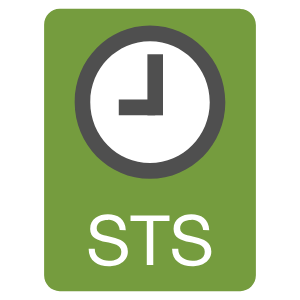

# AWS STS

<figure>
  
    <figcaption><center>AWS STS<br><i>Image source: <a href="https://vecta.io/symbols/23/aws-security-identity-compliance/14/iam-aws-sts-2">Vecta.io</a></i></center></figcaption>
</figure>

**Overview**: AWS Security Token Service (STS) is the service that issues temporary, limited-privilege credentials for IAM users, federated users, and cross-account access. It is central to almost every authorization pattern on the exam — understanding STS is critical because nearly every temporary credential scenario involves it.

**Domain weight**: STS is tested within the IAM domain (~20% of SCS-C03). It appears in questions about cross-account access, federation, MFA enforcement, credential revocation, and confused deputy prevention.

## 1. Purpose of Temporary Credentials

- Temporary credentials solve the problem of long-lived access keys — if a long-lived key is compromised, it stays valid until manually rotated or deleted
- STS credentials consist of three values: `AccessKeyId`, `SecretAccessKey`, and `SessionToken`
- Credentials expire automatically after a configurable period (default 1 hour, max 12 hours for `AssumeRole`)
- Cannot be used after expiration — no manual cleanup needed
- Are the recommended pattern for all AWS access: roles over users, temporary over permanent

## 2. STS API Reference

| API                          | Authentication Required              | Use Case                                                            |
| ---------------------------- | ------------------------------------ | ------------------------------------------------------------------- |
| `AssumeRole`                 | IAM user, role, or federated user    | Get credentials for a role in the same or different AWS account     |
| `AssumeRoleWithSAML`         | SAML assertion (no AWS creds needed) | Get credentials for a user authenticated by a SAML 2.0 IdP          |
| `AssumeRoleWithWebIdentity`  | OIDC token (no AWS creds needed)     | Get credentials for a user authenticated by a web identity provider |
| `GetSessionToken`            | IAM user or AWS account root user    | Get credentials for the caller, typically to enforce MFA            |
| `GetFederationToken`         | IAM user                             | Get credentials for a federated user with a custom policy           |
| `DecodeAuthorizationMessage` | Any authenticated principal          | Decode encoded authorization failure messages                       |

### 2.1. AssumeRole

- Most commonly tested STS API on the exam
- Used for: cross-account access, same-account role chaining, and granting access to applications

**Parameters**:

| Parameter         | Required | Description                                                                              |
| ----------------- | -------- | ---------------------------------------------------------------------------------------- |
| `RoleArn`         | Yes      | The ARN of the role to assume                                                            |
| `RoleSessionName` | Yes      | A friendly identifier visible in CloudTrail and used for `aws:RoleSessionName` condition |
| `PolicyArns`      | No       | ARNs of managed session policies to restrict the session further                         |
| `Policy`          | No       | Inline JSON session policy to restrict the session further                               |
| `DurationSeconds` | No       | Session duration (900s–43,200s / 15min–12h). Default: 3,600s / 1h                        |
| `ExternalId`      | No       | Required for third-party access; prevents confused deputy                                |
| `SerialNumber`    | No       | The ARN of the MFA device to use for multi-factor authentication                         |
| `TokenCode`       | No       | The MFA token code (required if `SerialNumber` is provided)                              |
| `SourceIdentity`  | No       | A session tag that persists across role sessions for auditing                            |
| `Tags`            | No       | Session tags that can be used for ABAC                                                   |

**Response**: Temporary credentials + assumed role ARN + expiry timestamp

### 2.2. AssumeRoleWithSAML

- Used for SAML 2.0 federation with enterprise IdPs (AD FS, Okta, Ping, etc.)
- No AWS credentials required to call this API — authentication comes from the SAML assertion
- The SAML assertion must be signed by a trusted IdP and must include attributes mapping to the IAM role and principal name
- Maximum session duration: 1 hour (cannot be increased)

### 2.3. AssumeRoleWithWebIdentity

- Used for web identity federation with OIDC providers (Amazon Cognito, Login with Amazon, Google, Facebook)
- No AWS credentials required to call this API — authentication comes from the OIDC token
- **AWS now recommends Amazon Cognito** over direct federation with social IdPs
- Cognito Identity Pools use `AssumeRoleWithWebIdentity` internally to exchange tokens for IAM credentials
- Maximum session duration: 1 hour (cannot be increased)

### 2.4. GetSessionToken

- Used when an IAM user needs temporary credentials for themselves
- Typically used to enforce MFA — the user authenticates with their access key + MFA token and receives session credentials that carry the MFA context
- Returns credentials scoped to the user's existing permissions (cannot pass a session policy)
- Maximum session duration: 1 hour for MFA-authenticated sessions, 36 hours for non-MFA sessions
- Does NOT require an existing role — the credentials are for the calling user

### 2.5. GetFederationToken

- Used for custom federation scenarios where you build your own identity broker
- The caller must have `sts:GetFederationToken` permission
- You pass an inline policy that defines the permissions for the federated user
- Unlike `AssumeRole`, this API does NOT create an `AssumedRoleUser` — the credentials are issued directly to a "federated user" identity
- Maximum session duration: 36 hours (default 12 hours)
- Cannot use session tags with `GetFederationToken`

### 2.6. DecodeAuthorizationMessage

- Decodes the encoded `authorizationMessage` that appears in some AccessDenied CloudTrail events
- The decoded message shows exactly which policy statement and which condition caused the denial
- Useful for troubleshooting complex permission issues

## 3. STS Important Details

### 3.1. Credential Characteristics

- Access key format: `ASIAxxxxxxxxxxxx` (starts with ASIA for temporary vs AKIA for permanent)
- Expiration is returned as a timestamp in the API response
- The AWS SDK automatically refreshes credentials before they expire
- Once expired, the credentials return `AccessDenied` for any API call

### 3.2. Session Duration Limits

| API                         | Minimum      | Maximum        | Default       |
| --------------------------- | ------------ | -------------- | ------------- |
| `AssumeRole`                | 900s (15min) | 43,200s (12h)  | 3,600s (1h)   |
| `AssumeRoleWithSAML`        | 900s (15min) | 3,600s (1h)    | 3,600s (1h)   |
| `AssumeRoleWithWebIdentity` | 900s (15min) | 3,600s (1h)    | 3,600s (1h)   |
| `GetSessionToken`           | —            | 129,600s (36h) | 43,200s (12h) |
| `GetFederationToken`        | —            | 129,600s (36h) | 43,200s (12h) |

Note: The role's `MaxSessionDuration` setting in IAM can further limit the `AssumeRole` duration (minimum 3,600s, maximum 43,200s).

### 3.3. Regional STS Endpoints

- STS is a **global service** by default, accessible at the global endpoint `sts.amazonaws.com`
- **Regional endpoints** are available: `sts.<region>.amazonaws.com` (e.g., `sts.eu-west-1.amazonaws.com`)
- Benefits of regional endpoints: lower latency, better reliability, and can be used when the global endpoint is blocked by SCPs
- If you use the global endpoint, STS may route the request to any region
- For full region isolation, configure your account to use only regional STS endpoints (can be enforced via SCP)
- **Exam scenario**: An SCP blocks all actions outside specific regions. If STS is called via the global endpoint, the request might be denied because it routes through a disallowed region. The fix is to use a regional STS endpoint.

### 3.4. STS VPC Endpoints

- STS supports **VPC gateway endpoints** (not interface endpoints)
- Allows EC2 instances and other resources in a VPC to call STS without going through the internet
- A VPC endpoint policy can restrict which STS actions are allowed from the VPC
- **Exam scenario**: An EC2 instance in a private subnet cannot assume a role. The fix might be to add an STS VPC endpoint or configure a NAT gateway.

## 4. Session Policies

- When assuming a role, you can pass a session policy that restricts what the temporary credentials can do
- Session policies are **intersectional** — they can only restrict, never grant
- Effective permissions = (identity policy + resource policies) ∩ session policy ∩ permission boundary ∩ SCP

### 4.1. Passing Session Policies

```bash
aws sts assume-role \
  --role-arn "arn:aws:iam::123456789012:role/MyRole" \
  --role-session-name "MySession" \
  --policy-arns "arn:aws:iam::123456789012:policy/MySessionPolicy"
```

Or with an inline policy:

```bash
aws sts assume-role \
  --role-arn "arn:aws:iam::123456789012:role/MyRole" \
  --role-session-name "MySession" \
  --policy '{"Version":"2012-10-17","Statement":[{"Effect":"Deny","Action":"s3:DeleteBucket","Resource":"*"}]}'
```

### 4.2. Session Tags

- Tags that are passed as part of the `AssumeRole` call
- Used for ABAC — the session inherits the tags from the role being assumed, and additional tags can be passed
- Tags are visible in CloudTrail for auditing
- **Transitive tags**: Tags with `aws:PrincipalType` = `AssumedRoleUser` can be carried across role sessions using `sts:TransitiveKeys`
- Conditions: `aws:PrincipalTag/`, `aws:RequestTag/`, `aws:TagKeys` can be used to enforce tag requirements

## 5. MFA with STS

### 5.1. GetSessionToken with MFA

```bash
aws sts get-session-token \
  --serial-number arn:aws:iam::123456789012:mfa/user \
  --token-code 123456
```

- Returns temporary credentials that carry the MFA context
- The `aws:MultiFactorAuthPresent` condition key evaluates to `true` for these credentials
- Use this pattern to enforce MFA for sensitive operations

### 5.2. AssumeRole with MFA

```bash
aws sts assume-role \
  --role-arn "arn:aws:iam::123456789012:role/AdminRole" \
  --role-session-name "AdminSession" \
  --serial-number arn:aws:iam::123456789012:mfa/user \
  --token-code 123456
```

- The assumed role session also inherits the MFA context
- The `aws:MultiFactorAuthPresent` condition evaluates to `true` inside the role session
- **Exam tip**: This allows you to require MFA at the trust policy level for role assumption

### 5.3. Enforcing MFA with Conditions

```json
{
  "Effect": "Deny",
  "Action": "*",
  "Resource": "*",
  "Condition": {
    "BoolIfExists": {
      "aws:MultiFactorAuthPresent": "false"
    }
  }
}
```

- This is a common policy pattern to deny all actions if the caller did not use MFA
- `BoolIfExists` handles the case where the condition key does not exist (for long-lived credentials that do not carry MFA context)
- Can be used in SCPs, identity policies, or resource policies

## 6. Revoking Temporary Credentials

### 6.1. AWSRevokeOlderSessions

- An AWS managed policy that denies all actions from principals whose session credentials were issued before a specific timestamp
- The policy uses the `aws:TokenIssueTime` condition key

```json
{
  "Version": "2012-10-17",
  "Statement": {
    "Effect": "Deny",
    "Action": "*",
    "Resource": "*",
    "Condition": {
      "DateLessThan": {
        "aws:TokenIssueTime": "2026-05-30T00:00:00Z"
      }
    }
  }
}
```

- Attach this policy to a user or role to invalidate all sessions issued before the specified time
- **Use case**: Incident response — when credentials may be compromised, attach this policy to immediately revoke all active sessions
- The timestamp must be manually updated in the policy each time you want to revoke newer sessions
- Alternative: Use the `RevokeCurrentSessions` API (available for IAM roles)

### 6.2. RevokeCurrentSessions API

- Available for IAM roles in the IAM API
- Automatically attaches a policy with the current timestamp to the role
- All sessions issued before the current time are immediately denied
- Cleaner than manually managing `AWSRevokeOlderSessions` timestamps

## 7. GetCallerIdentity

- Returns details about the principal making the API call
- Response includes: `Account` (account ID), `Arn` (full principal ARN), `UserId` (unique principal ID)
- Useful for debugging which identity is being used, especially after assuming a role
- No special permissions required — any authenticated principal can call it
- Can be called from any AWS account to verify the current identity

## 8. STS and Cross-Account Access

### 8.1. Cross-Account Role Assumption Flow

1. Account A (target) creates an IAM role with a trust policy listing Account B as a trusted principal
2. Account B (source) grants its users `sts:AssumeRole` on the role ARN in Account A
3. A user in Account B calls `AssumeRole` with the target role ARN
4. STS validates the trust policy, authenticates the caller, and returns temporary credentials
5. The user now has access to resources in Account A based on the role's permissions

### 8.2. Confused Deputy Prevention

- The **confused deputy problem** occurs when an entity without permissions tricks a more privileged entity into performing actions on its behalf
- In the context of STS, a third-party service could be tricked into assuming a role meant for a different customer

**Solutions**:

| Mechanism           | Description                                                                                                                                                                                                         |
| ------------------- | ------------------------------------------------------------------------------------------------------------------------------------------------------------------------------------------------------------------- |
| `sts:ExternalId`    | A unique identifier that must match between the trust policy and the `AssumeRole` call. Used for third-party access. It is NOT a secret — it is a unique value that prevents cross-customer role assumption mixups. |
| `aws:SourceAccount` | Condition key in the trust policy that restricts which account can assume the role                                                                                                                                  |
| `aws:SourceOrgID`   | Condition key that restricts assumption to accounts within your AWS Organization                                                                                                                                    |
| `aws:SourceArn`     | Condition key that restricts assumption to requests that originate from a specific ARN                                                                                                                              |

### 8.3. External ID Exam Critical Points

- The external ID is visible in the trust policy and must match the value passed in the `AssumeRole` call
- It is NOT a secret credential — it is a unique identifier that prevents one customer from accidentally assuming a role meant for another
- Both the role creator and the third party must agree on the external ID value in advance
- If the external ID does not match, the `AssumeRole` call fails with `AccessDenied`

## 9. STS and Federation

### 9.1. SAML Federation

- The SAML IdP authenticates the user and generates a SAML assertion
- The SAML assertion is posted to the AWS SAML endpoint: `https://signin.aws.amazon.com/saml`
- STS validates the assertion via `AssumeRoleWithSAML` and returns temporary credentials
- The SAML assertion must include:
  - The IAM role ARN(s) the user is authorized to assume
  - A principal name identifier
  - The SAML subject type
- CloudTrail records the `AssumeRoleWithSAML` event for auditing

### 9.2. Web Identity Federation

- The web identity provider (Cognito, Google, Facebook, Amazon) issues an OIDC token
- The application calls `AssumeRoleWithWebIdentity` with the token from the IdP
- STS validates the token against the configured identity provider in IAM
- **Amazon Cognito Identity Pools** are the recommended approach — they handle the token exchange automatically and can map users to different roles based on the identity

### 9.3. IAM Roles Anywhere

- Extends STS to workloads running **outside** AWS
- Uses X.509 certificates to authenticate workloads
- The workload calls `CreateSession` (not `AssumeRole`) against the Roles Anywhere endpoint
- The service validates the certificate against a trust anchor (ACM Private CA or external CA)
- If valid, the workload receives temporary credentials for the associated IAM role
- Examinable as an extension of STS for hybrid cloud scenarios

## 10. SourceIdentity vs RoleSessionName

| Attribute         | Purpose                                                    | Persistence                    | CloudTrail                  |
| ----------------- | ---------------------------------------------------------- | ------------------------------ | --------------------------- |
| `RoleSessionName` | Identifies the session                                     | Per-session only               | Logged as `roleSessionName` |
| `SourceIdentity`  | Carries the original user identity across role assumptions | Persists through role chaining | Logged as `sourceIdentity`  |

- `RoleSessionName` is a required parameter for `AssumeRole` — a friendly name for the session
- `SourceIdentity` is optional — it carries the original user identity through role chains
- If User A assumes Role B and Role B then assumes Role C, `SourceIdentity` preserves "User A" through the chain
- Use the `sts:SourceIdentity` condition key in trust policies to require a specific source identity

## 11. STS and Role Chaining

- **Role chaining** is when a role assumes another role
- Example: Lambda function with Role A uses `AssumeRole` to get credentials for Role B, then uses Role B to access an S3 bucket
- Maximum role chaining depth: 2,000 API calls per session (not a chain depth limit, but a practical concern)
- Each hop reduces the session duration because the credentials expire at the minimum of the remaining time

**Exam considerations**:

- Role chaining is rarely the best pattern — prefer resource-based policies instead
- CloudTrail logs each hop separately, making auditing more complex
- Role chaining can break `aws:SourceIp` conditions because the source IP after the chain may be internal

## 12. STS Limits

| Limit                                                                        | Value                                                                                |
| ---------------------------------------------------------------------------- | ------------------------------------------------------------------------------------ |
| Maximum session duration (`AssumeRole`)                                      | 12 hours (configurable via `MaxSessionDuration` on the role)                         |
| Maximum session duration (`GetFederationToken`, `GetSessionToken`)           | 36 hours                                                                             |
| Maximum session duration (`AssumeRoleWithSAML`, `AssumeRoleWithWebIdentity`) | 1 hour                                                                               |
| Maximum role chaining depth                                                  | Not formally limited, but session time decreases with each hop                       |
| STS API request rate                                                         | Varies by region; throttling returns `ThrottlingException` or `RequestLimitExceeded` |
| Size of a session policy                                                     | 4,096 bytes (inline), 10 managed policy ARNs                                         |
| Number of session tags                                                       | 50 maximum                                                                           |

## 13. STS and CloudTrail

- Every STS API call is logged in CloudTrail
- Key fields to examine in CloudTrail events:
  - `eventName`: The STS API called (e.g., `AssumeRole`, `GetSessionToken`)
  - `userIdentity`: Who made the call, including the ARN and account ID
  - `requestParameters`: Includes `roleArn`, `roleSessionName`, `durationSeconds`, `externalId`
  - `responseElements`: Includes `assumedRoleUser` ARN, `credentials` (expiration only, not the key/secret)
  - `sourceIPAddress`: The IP address of the caller
- When investigating a potential compromise, look for `AssumeRole` calls from unusual IP addresses or at unusual times

## 14. Exam Tips

- STS is the engine behind all temporary credentials — every time you see a role on the exam, think STS
- Temporary credentials start with `ASIA` (vs `AKIA` for permanent keys)
- Session duration limits are different per API — `AssumeRole` maxes at 12h, federation APIs at 1h
- Regional STS endpoints solve problems where SCPs restrict regions and the global STS endpoint routes through a blocked region
- `GetCallerIdentity` requires no special permissions — use it to verify which identity is active
- `AWSRevokeOlderSessions` uses `aws:TokenIssueTime` to invalidate sessions issued before a timestamp — essential for incident response
- The External ID is NOT a secret — it prevents confused deputy, not unauthorized access
- Session policies can only restrict, never grant — they are intersected with the identity policy
- `SourceIdentity` persists through role chaining, `RoleSessionName` does not
- MFA context (`aws:MultiFactorAuthPresent`) is inherited by assumed role sessions
- STS VPC gateway endpoints allow instances in private subnets to assume roles without internet access
- If a cross-account `AssumeRole` call fails, check: trust policy, External ID, SCPs, and the source user's `sts:AssumeRole` permission
