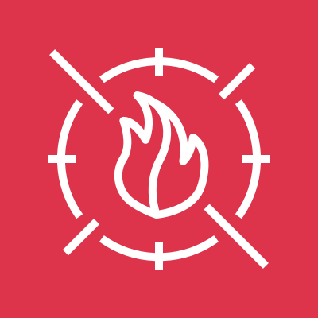

# AWS WAF (Web Application Firewall)

<figure>
  
  <figcaption>
AWS WAF <i>Image source: AWS Documentation</i>
</figcaption>
</figure>

**Overview**: AWS WAF is a managed web application firewall that protects web applications from common web exploits. It monitors and controls HTTP(S) traffic to CloudFront, ALB, API Gateway, AppSync, and Cognito Hosted UI. WAF is the primary service for protecting applications at Layer 7 (application layer).

**Domain weight**: WAF appears in the Infrastructure Security domain (~20% of SCS-C03) and is heavily tested alongside CloudFront, ALB, and Shield for web application protection scenarios.

## 1. Resources WAF Can Protect

| Resource                          | Traffic Inspected       |
| --------------------------------- | ----------------------- |
| **CloudFront distribution**       | Edge locations (global) |
| **Application Load Balancer**     | Regional                |
| **API Gateway (REST, HTTP)**      | Regional                |
| **AWS AppSync**                   | Regional                |
| **Cognito User Pool (Hosted UI)** | Regional                |

- CloudFront + WAF is the most common combination — WAF at the edge stops attacks before they reach origin servers
- WAF is regional when used with ALB, API Gateway, AppSync, or Cognito
- WAF is global when used with CloudFront (rules are deployed to edge locations)

## 2. Web ACL (Access Control List)

### 2.1. Core Concepts

| Concept            | Description                                                                      |
| ------------------ | -------------------------------------------------------------------------------- |
| **Web ACL**        | The main configuration unit — a set of rules applied to a resource               |
| **Rule**           | A single inspection condition + action (Allow, Block, Count, CAPTCHA, Challenge) |
| **Rule group**     | A collection of reusable rules (managed or custom)                               |
| **Default action** | What happens when a request does not match any rule (Allow or Block)             |
| **Capacity**       | Web ACL Capacity Units (WCUs) — a measure of rule complexity                     |

### 2.2. Rule Actions

| Action        | Description                                                            |
| ------------- | ---------------------------------------------------------------------- |
| **Allow**     | Allow the request to proceed                                           |
| **Block**     | Block the request (returns 403 Forbidden)                              |
| **Count**     | Count the request but take no action — used for testing/monitoring     |
| **CAPTCHA**   | Present a CAPTCHA puzzle — request proceeds if solved                  |
| **Challenge** | Present a silent challenge (JS challenge) — request proceeds if solved |

- **Count** is critical for testing rules before enabling Allow/Block — use it to validate that the rule matches the expected traffic without impacting users

### 2.3. Web ACL Capacity Units (WCUs)

- Each rule consumes a certain number of WCUs based on its complexity
- Maximum WCUs per Web ACL: **1,500** (soft limit, can be increased)
- Managed rule groups have a fixed WCU cost
- Complex custom rules (multiple conditions, regex) consume more WCUs
- If you exceed the WCU limit, simplify rules or remove unused rule groups

## 3. Rule Types

### 3.1. Rate-Based Rules

- Limits requests from a single IP address within a 5-minute window
- Use case: Block IPs that exceed a threshold (e.g., 2,000 requests in 5 minutes)
- Commonly used to mitigate DDoS attacks and brute force attempts
- Can be combined with other conditions (e.g., rate limit only for login endpoint)
- **Exam scenario**: A web application is experiencing a DDoS attack from many IPs hitting the login page → create a **rate-based rule** to block IPs exceeding a threshold on the `/login` path.

### 3.2. IP Set Rules

- Allow or block requests based on source IP addresses (CIDR ranges)
- Use cases:
  - **Block known-bad IPs** (from threat intelligence feeds)
  - **Allow only corporate IPs** for administrative endpoints
- IP sets can be reused across multiple rules

### 3.3. String and Regex Match Rules

- Inspect HTTP headers, request body, query string, or URI path for patterns
- Use case: Block SQL injection, XSS, comment spam
- Regex patterns can be complex and consume more WCUs

### 3.4. Geo Match Rules

- Allow or block requests based on country of origin
- Use case: Block traffic from countries where the application has no users
- Uses MaxMind GeoIP database

### 3.5. Size Constraint Rules

- Block requests based on size of specific parts (body, header, query string)
- Use case: Block excessively large request bodies (potential buffer overflow)

### 3.6. Label-Based Rules

- Rules can add labels to requests that match
- Subsequent rules can match on labels
- Enables complex rule chaining — "if request matches rule A, then apply rule B"

## 4. Managed Rule Groups

### 4.1. AWS Managed Rules

| Rule Group                                    | Protection                                                          |
| --------------------------------------------- | ------------------------------------------------------------------- |
| **AWS-AWSManagedRulesCommonRuleSet**          | Core rule set — SQL injection, XSS, LFI, RFI, PHP/WordPress attacks |
| **AWS-AWSManagedRulesSQLiRuleSet**            | SQL injection protection specifically                               |
| **AWS-AWSManagedRulesKnownBadInputsRuleSet**  | Known malicious patterns                                            |
| **AWS-AWSManagedRulesAmazonIpReputationList** | IPs known to be malicious (from AWS threat intel)                   |
| **AWS-AWSManagedRulesAnonymousIpList**        | Anonymous IPs (VPN, Tor, proxies)                                   |
| **AWS-AWSManagedRulesBotControlRuleSet**      | Bot detection and mitigation (crawlers, scrapers, scripts)          |
| **AWS-AWSManagedRulesATPRuleSet**             | Account Takeover Prevention — protect login pages                   |
| **AWS-AWSManagedRulesACFPRuleSet**            | Fraud Control — prevent fake accounts                               |

### 4.2. Bot Control

- Detects and manages bots (good bots like Googlebot vs bad bots like scrapers)
- Categorizes bots: verified, unverified, malicious
- Can block, count, or allow based on bot category
- Uses machine learning for bot detection
- **Exam scenario**: A website is being scraped by automated scripts → enable **AWS Managed Bot Control** rules in WAF.

### 4.3. Account Takeover Prevention (ATP)

- Protects login endpoints from credential stuffing and brute force attacks
- Creates a client session token to track user behavior
- Blocks suspicious login attempts
- Must be combined with rate-based rules for full protection

### 4.4. Fraud Control (ACFP)

- Prevents fake account creation
- Tracks client behavior across account creation attempts
- Blocks requests from suspicious patterns (automated creation, disposable email domains)

## 5. CAPTCHA and Challenge

### 5.1. CAPTCHA

- Presents a visual puzzle to the user
- User must solve the puzzle to proceed
- Best for: Suspicious but not clearly malicious traffic
- Reduced friction: Users who pass CAPTCHA once get a token that can be used for a configurable period

### 5.2. Challenge (Silent Challenge)

- Presents a JavaScript challenge (no user interaction required)
- Verifies the client is a legitimate browser (not a script or bot)
- Best for: Automated script mitigation without impacting legitimate users
- Lower friction than CAPTCHA

**Exam scenario**: A web application is being targeted by automated scripts. The security team wants to stop them without impacting legitimate users → use **WAF Challenge** action (silent JS challenge) instead of CAPTCHA.

## 6. Logging and Monitoring

### 6.1. WAF Logs

- Logs can be sent to: **S3**, **CloudWatch Logs**, **Kinesis Data Firehose**
- Logs include: request details, matched rules, action taken
- Sampling is applied by default — not every request is logged
- Full logging requires enabling it in the Web ACL configuration

### 6.2. CloudWatch Metrics

- WAF publishes metrics to CloudWatch: `AllowedRequests`, `BlockedRequests`, `CountedRequests`
- Can create alarms based on blocking rates or error rates
- Per-rule metrics are available (with `Rule` and `WebACL` dimensions)

### 6.3. AWS Managed Rule Logging

- When a managed rule blocks a request, the rule label indicates which specific rule triggered
- Example: `awswaf:managed:aws:common-rule-set:CrossSiteScripting:XSSScript`
- Enables fine-grained understanding of what type of attack was blocked

## 7. WAF + Shield

| Service             | Layer        | Protection                                                      |
| ------------------- | ------------ | --------------------------------------------------------------- |
| **WAF**             | Layer 7      | Web application attacks (SQLi, XSS, rate limiting, bot control) |
| **Shield Standard** | Layers 3/4   | Free network-layer DDoS protection (automatic)                  |
| **Shield Advanced** | Layers 3/4/7 | Enhanced DDoS protection + cost protection + DRT access         |

- WAF and Shield are complementary — Shield handles volumetric DDoS, WAF handles application-level attacks
- Shield Advanced provides WAF cost protection and additional DDoS mitigation capacity

## 8. WAF Security Best Practices

- **Use AWS Managed Rules** as a baseline — they cover OWASP Top 10 and common threats
- **Enable rate-based rules** to protect against DDoS and brute force
- **Use Count action** when testing new rules — verify they match correctly before switching to Block
- **Enable WAF logging** to S3 or CloudWatch Logs for analysis
- **Monitor WAF metrics** — set alarm for spikes in blocked requests
- **Use CAPTCHA/Challenge** for suspicious traffic instead of immediately blocking
- **Combine WAF with Shield Advanced** for comprehensive protection
- **Scope rules to specific paths** — rate limiting only on `/login`, string matching only on API endpoints
- **Use labels and label matching** for complex rule chaining
- **Apply WAF at CloudFront** for edge-based protection (stops attacks before they reach origin)

## 9. Limits and Quotas

| Resource                              | Limit             |
| ------------------------------------- | ----------------- |
| Web ACLs per account                  | 100 (soft limit)  |
| Rules per Web ACL                     | 100               |
| Web ACL capacity units (WCUs) per ACL | 1,500             |
| IP sets per account                   | 100               |
| IP addresses per IP set               | 10,000            |
| Regex pattern sets per account        | 20                |
| Rate-based rule evaluation window     | 5 minutes (fixed) |

## 10. WAF vs Other Firewalls

| Firewall             | Layer      | Scope                     |
| -------------------- | ---------- | ------------------------- |
| **WAF**              | Layer 7    | Web applications (HTTP/S) |
| **Network Firewall** | Layers 3-7 | VPC-wide traffic          |
| **Security Groups**  | Layer 3/4  | Instance-level            |
| **NACLs**            | Layer 3/4  | Subnet-level              |
| **Shield**           | Layers 3/4 | DDoS protection           |

## 11. Exam Tips

1. **WAF protects at Layer 7** (web application layer). Security groups and NACLs protect at Layers 3-4 (network layer). They are complementary.

2. **WAF + CloudFront** is the most common architecture — WAF at the edge stops attacks before they reach the origin.

3. **Rate-based rules** mitigate DDoS / brute force by limiting requests per IP in a 5-minute window.

4. **AWS Managed Rules** cover OWASP Top 10 (SQLi, XSS), known bad IPs, anonymous IPs, and bots.

5. **Count action** is used for testing rules before enabling Allow/Block — it counts matching requests without taking action.

6. **CAPTCHA** (visual puzzle) vs **Challenge** (silent JS challenge) — Challenge has less user friction.

7. **Bot Control** identifies and manages bots (good and bad) using ML.

8. **ATP (Account Takeover Prevention)** protects login endpoints from credential stuffing.

9. **ACFP (Account Creation Fraud Prevention)** prevents fake account creation.

10. **WAF logs** to S3, CloudWatch Logs, or Kinesis Firehose — enable for analysis and compliance.

11. **Labels** enable rule chaining — a rule labels a request, and another rule matches on that label.

12. **WCUs** (Web ACL Capacity Units) limit how complex a Web ACL can be — max 1,500 per ACL.

13. **Geo match** blocks or allows traffic from specific countries.

14. **IP sets** allow blocking/allowing specific CIDR ranges — reusable across rules.

15. **WAF is not a substitute for Shield** — WAF handles application-layer attacks, Shield handles volumetric DDoS. Both should be used together.
